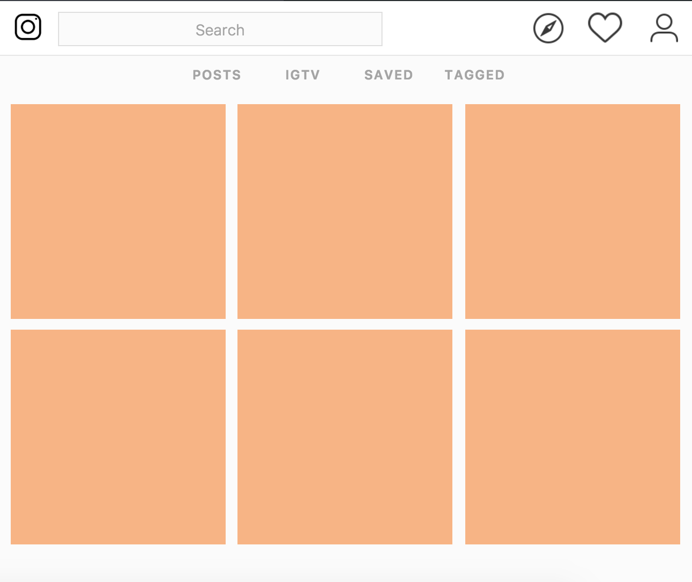

# Mockup Magic

## The Goal
As you saw in the previous lab, CSS grid allows you to create websites that rival some of the most popular web destinations today. Now that you've had some experience with nesting grids, it's time to push those skills even more.

## The Lab
In this lab you'll be given three mockups of popular websites to match. Once again you'll be using CSS grids, and specifically the concept of nesting grids. However, in this lab you won't have any guidance other than the mockup. It's up to you to break up the given html in any way you see fit to get to your final goal. For each mockup you'll be given the appropriate HTML. As you move through the lab the mockups will continue to increase in difficulty. Feel free to add any ids or classes that you think you need and get to styling!

<!-- these will be mockups without a ton of content. Indicate that they're getting harder. -->
<!-- try to find an alternate to pinterest -->
#### Mockup One: Instagram
You'll be using the html in instagram.html and adding your own styling to instagram.css.

#### Mockup Two: Airbnb
You'll be using the html in airbnb.html and adding your own styling to airbnb.css.

#### Mockup Three: Pinterest
You'll be using the html in pinterest.html and adding your own styling to pinterest.css.

#### Stretch
1. Choose your favorite mockup from above, go to the website, and add another element of content to your page. This could be images for Pinterest, CSS hover effects, comments on instagram, or house descriptions on airbnb. Style this added content so that it looks the same way it does on the website!
2. Pick the website that you spend the most time on and create your own mockup based on that page! When you're done show a partner and see if they can guess what website you were modeling your page after.

<!-- when you reference file names use back ticks -->
<!-- upperline website individual elements is flexbox -->
<!-- flexbox could be one abstract lab and one grid lab  -->
<!-- when i'm ready to launch into that check out the lesson plans that are written already -->
